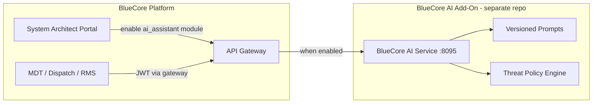

# BlueCore AI Add-On Integration

BlueCore AI is an **optional add-on** deployed separately from the core BlueCore platform. Agencies enable it in the System Architect Portal; when disabled, BlueCore operates without any AI assistant dependency.

## Architecture



## Enabling the Add-On

1. Deploy BlueCore AI from this repository (see root README).
2. In BlueCore `.env`, set:

```bash
BLUECORE_AI_ASSISTANT_ENABLED=true
AI_ASSISTANT_SERVICE_URL=http://bluecore-ai:8095
```

3. In System Architect Portal, enable the **AI Assistant** module for the agency environment.
4. Ensure `JWT_SECRET` and `SERVICE_AUTH_TOKEN` match between BlueCore gateway and this service.

## Gateway Routes (BlueCore)

When enabled, BlueCore gateway proxies:

| Method | Gateway Path | Add-On Path |
|--------|--------------|-------------|
| POST | `/v1/ai/assistant/chat` | `/v1/assistant/chat` |
| POST | `/v1/ai/assistant/narrative` | `/v1/assistant/narrative` |
| POST | `/v1/ai/threat/assess` | `/v1/threat/assess` |
| GET | `/v1/ai/threat/policies` | `/v1/threat/policies` |

All routes require a valid BlueCore user JWT.

## CJIS Considerations

- Deploy add-on in the same security boundary as BlueCore when handling CJI.
- Use `LLM_PROVIDER=ollama` for air-gapped inference, or Azure OpenAI with BAA for cloud.
- Threat assessments are audit-logged with user attribution.
- Protected characteristics are excluded from threat scoring.

## Threat Policy Configuration

Agencies upload policy profiles via `PUT /v1/threat/policies/{policy_id}`. Indicators, weights, and thresholds must align with department-approved officer safety policies.

## Operational Limitation

BlueCore AI provides informational decision support only. Final tactical and legal decisions remain with authorized personnel.
